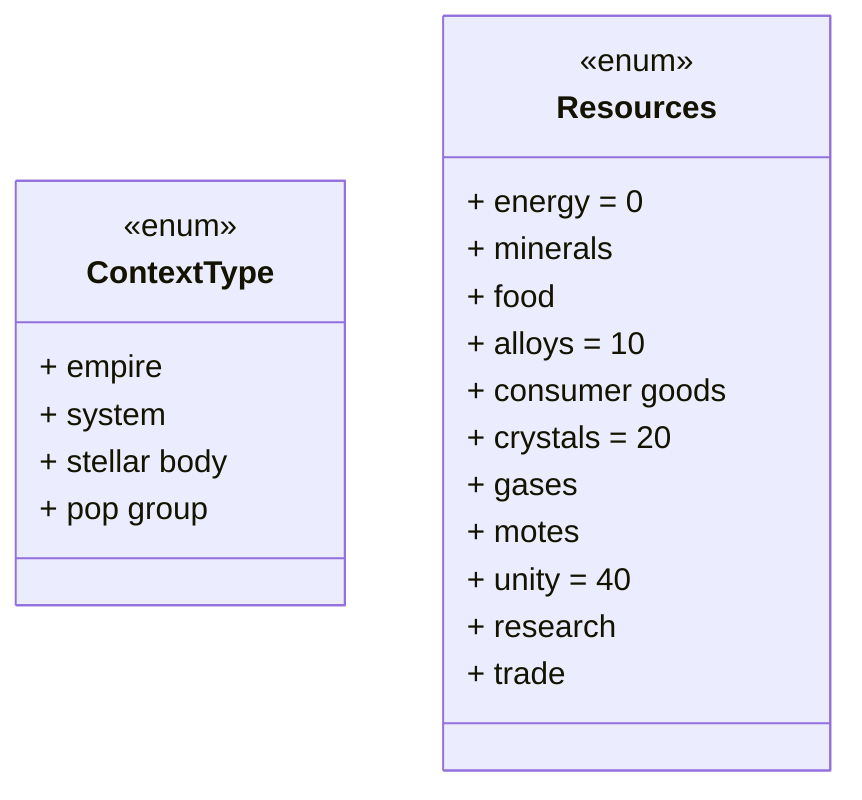
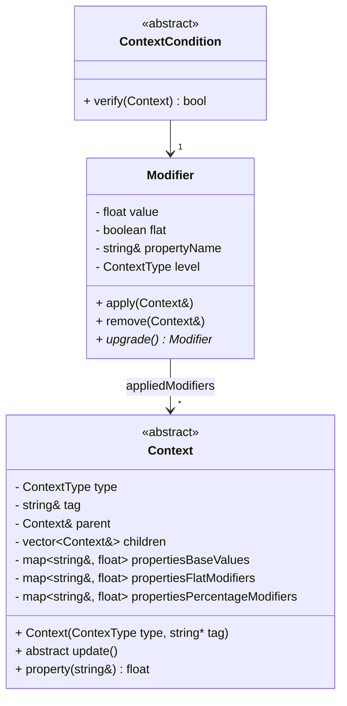
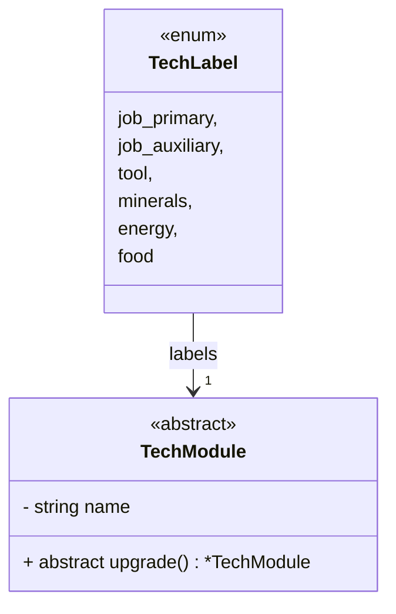
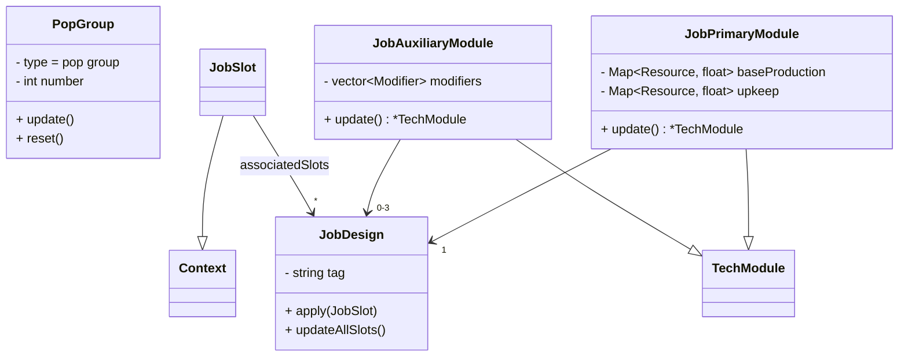
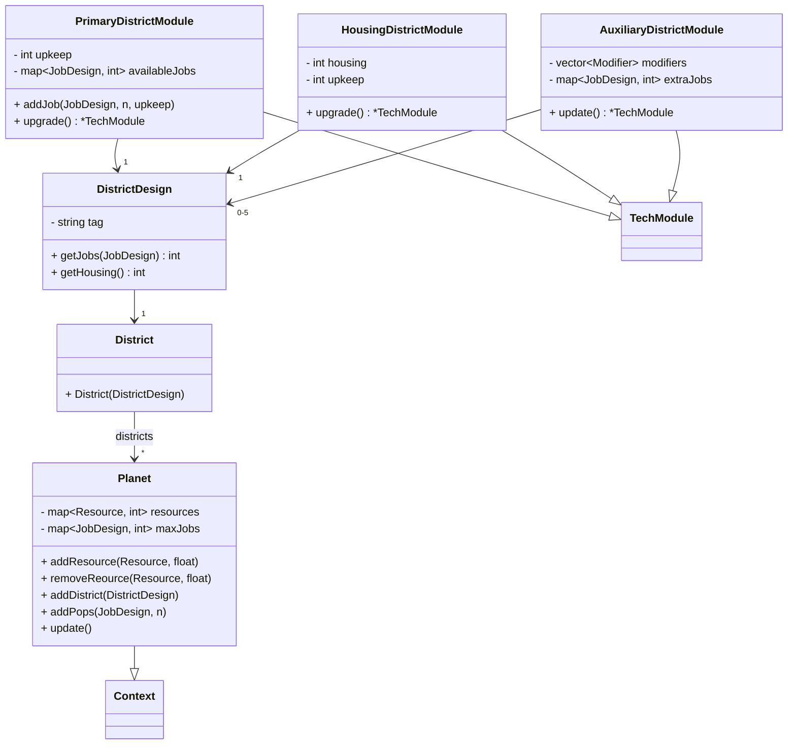

# Desing

## Package 1 - Basic

This package contains basic classes and enums for the whole application.

The ContextType enum defines the types that the abstract class Context can have.

The Resources enum defines the types of resources that exist. The resources between 0 and 9 will be considered basic, the resources between 10 and 19 will be considered advanced, the resources between 20 and 39 will be considered strategic, the resources between 40 and 49 will be considered abstract.

The Context class is an abstract class that represent a generic element in the game (as suggested by the ContextType enum). Contexts are organized hierarchycally, in a tree, whit Empires on top, then the Systems of an Empire, the stellar bodies in them (planets, stars, asteroids, space structures...), the districts on planets and jobs in districts. Contexts have a map of properties (name, value) that represents the a generic value of the context, and also their flat and percentage modifiers. The total value of a property is calculated as:
> total = (base value + flat modifiers) * percentage modifiers

When a modifier is applied to a context, first the context's type is evaluated: if it's superior or inferior to the "level" of the modifier, the modifier is applied to all the children or to the parent (respectively) of the context, until it reaches the correct level. Then, the modifier will be added to the "appliedModifiers" array, and its value will be added to the "flat modifiers" of the property associated to the modifier (its propertyName string), if the flat attribute is true, else it will be added to the "percentage modifiers".

When a modifier is removed, it will be removed by the appliedModifiers array and its effects will be removed from the maps.

Implementations of ContextContion:
|name|description|
|----|----|
|TagCondition|Controls that a context has a specified tag|

The upgrade method of modifiers returns an upgraded version of the Modifier itself, that influences the same properties in the same way (flat or not).

The TechModule abstract class will represent the various tech-modules in the game. The fundamental method "upgrade" returns a new, more powerful, version of the module. Used while innovating.

## Package 2 - Jobs and Pops

The class PopGroup represents all pops, on a single celestial body, for a single job-design. The properties it can have are:
- "prd_{res}": the quantity of resource "res", as string (parse of the value)
- "upk_{res}": the upkeep of resource "res", as string (parse of the value)

The update method adds the production to (and removes upkeep from) the planet storage. The "reset" method clears all the properties. It will be used when the slot is applied a job-design.

The JobDesign contains a reference to a JobPrimaryModule (defines primary characteristics) and to some JobAuxiliaryModules (defining some side effects). It can be "applied" to a PopGroup, setting production and upkeeps. The "updateAllSlots" method re-applies the design to all groups that previously had it.

## Package 3 - Planet Management

The planet class contains all the data that represents a single planet. It has some properties:
- "maxd", max districts: represents the max number of districts a planet can hold
- "st_{res}", storage: the max number of storage for a specific resource. The values of "resources" map can't go over such values.
- "hsng", housing: the current total housing of the planet

The addDistrict method instantiate a new district, with the given DistrictDesign. It updates the number of jobs on the planet, updates the housing property and applies the modifiers, according to the contents of the DistrictDesign.

The addPops method adds the number of pops specified, adding them to an existing group or creating a new group if there's none with such jobDesign. If pops for an unavailable job are added, they will be added as unemployed (no JobDesign).