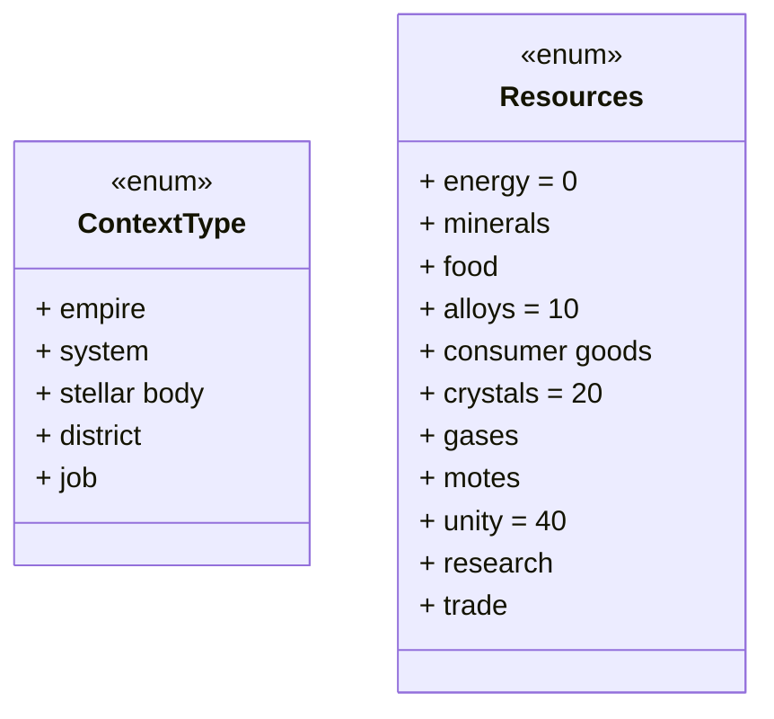
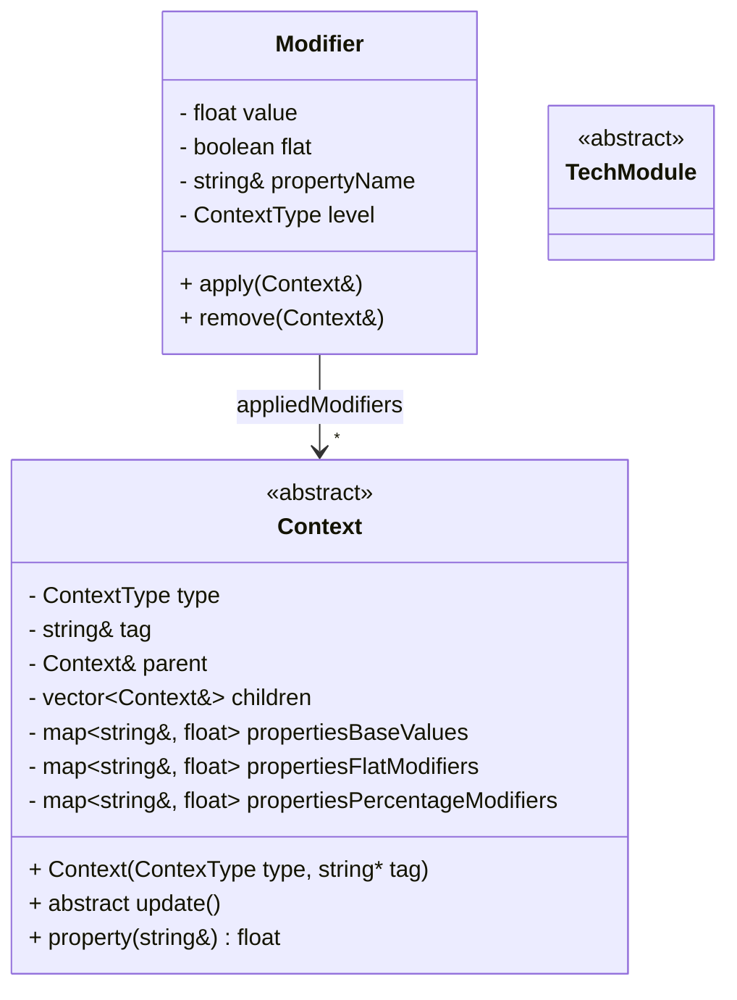

# Desing

## Package 1 - Basic

This package contains basic classes and enums for the whole application.

The ContextType enum defines the types that the abstract class Context can have.

The Resources enum defines the types of resources that exist. The resources between 0 and 9 will be considered basic, the resources between 10 and 19 will be considered advanced, the resources between 20 and 39 will be considered strategic, the resources between 40 and 49 will be considered abstract.

The Context class is an abstract class that represent a generic element in the game (as suggested by the ContextType enum). Contexts are organized hierarchycally, in a tree, whit Empires on top, then the Systems of an Empire, the stellar bodies in them (planets, stars, asteroids, space structures...), the districts on planets and jobs in districts. Contexts have a map of properties (name, value) that represents the a generic value of the context, and also their flat and percentage modifiers. The total value of a property is calculated as:
> total = (base value + flat modifiers) * percentage modifiers

When a modifier is applied to a context, first the context's type is evaluated: if it's superior or inferior to the "level" of the modifier, the modifier is applied to all the children or to the parent (respectively) of the context, until it reaches the correct level. Then, the modifier will be added to the "appliedModifiers" array, and its value will be added to the "flat modifiers" of the property associated to the modifier (its propertyName string), if the flat attribute is true, else it will be added to the "percentage modifiers".

When a modifier is removed, it will be removed by the appliedModifiers array and its effects will be removed from the maps.